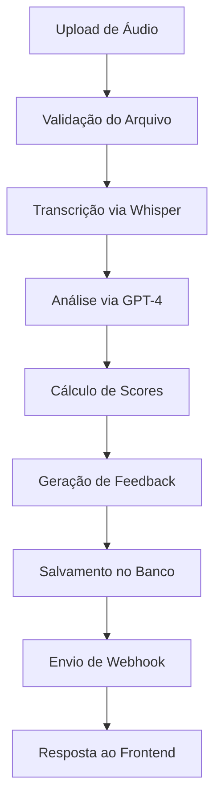
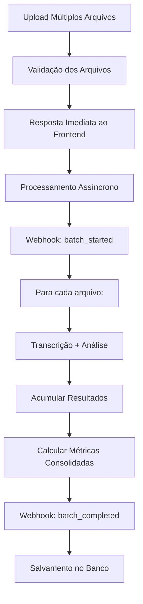

# 🎯 NIAH! - Sistema de Análise Inteligente de Atendimento

## 📋 Visão Geral

**NIAH!** é uma plataforma SaaS completa para análise automatizada de ligações de atendimento ao cliente usando Inteligência Artificial. O sistema permite que empresas avaliem a qualidade de seus atendimentos de forma objetiva, gerando relatórios detalhados, métricas de performance e insights acionáveis para melhoria contínua.

### 🎯 Problema Resolvido
- **Avaliação manual** de ligações é demorada e subjetiva
- **Falta de padronização** na avaliação de atendentes
- **Dificuldade em escalar** análises para grandes volumes
- **Inconsistência** entre avaliadores diferentes
- **Ausência de dados objetivos** para tomada de decisão

### ✨ Solução Oferecida
- **Análise automatizada** usando AI (OpenAI GPT-4 + Whisper)
- **Critérios customizáveis** por empresa/campanha
- **Processamento em lote** de até 50 ligações simultâneas
- **Relatórios detalhados** com scores e feedback específico
- **Dashboard analytics** com métricas consolidadas
- **Sistema multitenancy** para múltiplas empresas

---

## 🏗️ Arquitetura do Sistema

### 🔧 Stack Tecnológico

#### **Frontend**
- **React 18** com TypeScript
- **Vite** como bundler
- **Tailwind CSS** para estilização
- **Shadcn/UI** para componentes
- **Context API** para gerenciamento de estado
- **React Router** para navegação

#### **Backend**
- **Node.js** com Express.js
- **Supabase** como banco de dados (PostgreSQL)
- **JWT** para autenticação
- **Multer** para upload de arquivos
- **Axios** para requisições HTTP

#### **Inteligência Artificial**
- **OpenAI Whisper** para transcrição de áudio
- **OpenAI GPT-4** para análise de sentimentos e critérios
- **Processamento assíncrono** para otimização

#### **Infraestrutura**
- **Supabase** (Backend-as-a-Service)
- **Edge Functions** para processamento
- **Row Level Security (RLS)** para isolamento de dados
- **Webhooks** para notificações em tempo real

---

## 👥 Sistema Multitenancy

### 🏢 Estrutura de Empresas
O sistema é **completamente multitenancy**, onde:

- **Cada empresa** possui dados completamente isolados
- **Company ID** é usado como chave de isolamento
- **RLS (Row Level Security)** garante segurança dos dados
- **Usuários** pertencem a uma única empresa
- **Critérios de avaliação** são específicos por empresa

### 🔐 Níveis de Acesso
```
├── Super Admin (Sistema)
│   └── Acesso completo ao sistema
├── Gestor da Empresa
│   ├── Gerenciar usuários da empresa
│   ├── Configurar critérios de avaliação
│   ├── Visualizar todas as análises
│   └── Acessar dashboard completo
└── Usuário da Empresa
    ├── Enviar ligações para análise
    ├── Visualizar próprias análises
    └── Acessar relatórios básicos
```

---

## 🔑 Sistema de Autenticação

### 📝 Registro e Login
- **Email + Senha** para autenticação
- **JWT Tokens** com expiração configurável
- **Refresh tokens** para renovação automática
- **Validação de empresa** no momento do login

### 👤 Gestão de Usuários
```sql
-- Estrutura de usuários
users {
  id: UUID (Primary Key)
  email: string (Unique)
  password: string (Hashed)
  name: string
  type: 'user' | 'gestor'
  company_id: UUID (Foreign Key)
  created_at: timestamp
  updated_at: timestamp
}

companies {
  id: UUID (Primary Key)
  name: string
  slug: string (Unique)
  settings: JSONB
  created_at: timestamp
}
```

### 🛡️ Middleware de Segurança
- **verifyJWT**: Valida tokens em todas as rotas protegidas
- **Company isolation**: Automaticamente filtra dados por company_id
- **Rate limiting**: Proteção contra ataques
- **CORS configurado** para domínios específicos

---

## 📱 Páginas e Funcionalidades

### 🏠 **Dashboard Principal**
- **Métricas consolidadas** da empresa
- **Gráficos de performance** ao longo do tempo
- **Top performers** e **áreas de atenção**
- **Resumo de análises recentes**

### 🎯 **Análise Individual**
**Rota**: `/analise-individual`
- Upload de **arquivo único** de áudio
- Seleção de **critérios de avaliação**
- **Análise em tempo real** (2-3 minutos)
- **Resultado detalhado** com scores e feedback

### 📊 **Análise em Lote**
**Rota**: `/analise-lote`
- Upload de **até 50 arquivos** simultaneamente
- **Metadados por arquivo** (agente, campanha, cliente)
- **Processamento assíncrono** em background
- **Webhooks** para notificação de progresso
- **Resultados consolidados** com métricas de lote

### 📋 **Critérios de Avaliação**
**Rota**: `/criterios`
- **CRUD completo** de critérios personalizados
- **Subcritérios** com pesos específicos
- **Templates** pré-configurados
- **Versionamento** de critérios

### 👥 **Gestão de Agentes**
**Rota**: `/agentes`
- **Cadastro** de atendentes
- **Performance individual** por agente
- **Histórico** de análises
- **Rankings** e comparativos

### 🏢 **Gestão de Usuários** (Apenas Gestores)
**Rota**: `/usuarios`
- **Convidar** novos usuários
- **Gerenciar permissões**
- **Visualizar atividades**
- **Relatórios de uso**

### ⚙️ **Configurações**
**Rota**: `/configuracoes`
- **Configurações da empresa**
- **Integrações** (webhooks, APIs)
- **Preferências** de notificação
- **Backup** e exportação de dados

---

## 🚀 APIs e Endpoints

### 🔐 **Autenticação** (`/api/v1/auth`)
```javascript
POST /login
// Body: { email, password }
// Response: { success, user, token, expires_in }

POST /refresh
// Headers: { Authorization: Bearer <token> }
// Response: { success, token }

GET /me
// Headers: { Authorization: Bearer <token> }
// Response: { success, user }
```

### 📊 **Análise Individual** (`/api/v1/analyze-call`)
```javascript
POST /analyze-call
// Content-Type: multipart/form-data
// Body: {
//   audio: File,
//   criteria: JSON,
//   webhook_url?: string,
//   metadata?: JSON
// }
// Headers: { Authorization: Bearer <token> }
```

### 📈 **Análise em Lote** (`/api/v1/analyze-batch-proxy`)
```javascript
POST /analyze-batch-proxy
// Content-Type: multipart/form-data
// Body: {
//   files: File[],
//   criteria: JSON,
//   webhook: string,
//   agent_0: string,
//   campaign_0: string,
//   name_0: string,
//   // ... metadados por arquivo
// }
// Headers: { Authorization: Bearer <token> }
```

### 🎯 **Critérios** (`/api/v1/criteria`)
```javascript
GET /criteria
// Lista critérios da empresa

POST /criteria
// Cria novo critério

PUT /criteria/:id
// Atualiza critério

DELETE /criteria/:id
// Remove critério
```

---

## 🔄 Fluxo de Análise Detalhado

### 1️⃣ **Análise Individual**


### 2️⃣ **Análise em Lote**


---

## 📊 Estrutura de Dados

### 🗃️ **Principais Tabelas**

#### **users** - Usuários do sistema
```sql
CREATE TABLE users (
  id UUID PRIMARY KEY DEFAULT gen_random_uuid(),
  email VARCHAR UNIQUE NOT NULL,
  password_hash VARCHAR NOT NULL,
  name VARCHAR NOT NULL,
  type VARCHAR CHECK (type IN ('user', 'gestor')) DEFAULT 'user',
  company_id UUID REFERENCES companies(id),
  created_at TIMESTAMP DEFAULT NOW(),
  updated_at TIMESTAMP DEFAULT NOW()
);
```

#### **companies** - Empresas (Multitenancy)
```sql
CREATE TABLE companies (
  id UUID PRIMARY KEY DEFAULT gen_random_uuid(),
  name VARCHAR NOT NULL,
  slug VARCHAR UNIQUE NOT NULL,
  settings JSONB DEFAULT '{}',
  created_at TIMESTAMP DEFAULT NOW(),
  updated_at TIMESTAMP DEFAULT NOW()
);
```

#### **evaluation_lists** - Critérios de Avaliação
```sql
CREATE TABLE evaluation_lists (
  id UUID PRIMARY KEY DEFAULT gen_random_uuid(),
  name VARCHAR NOT NULL,
  description TEXT,
  company_id UUID REFERENCES companies(id),
  is_active BOOLEAN DEFAULT true,
  created_at TIMESTAMP DEFAULT NOW()
);
```

#### **criteria** - Critérios Específicos
```sql
CREATE TABLE criteria (
  id UUID PRIMARY KEY DEFAULT gen_random_uuid(),
  evaluation_list_id UUID REFERENCES evaluation_lists(id),
  name VARCHAR NOT NULL,
  description TEXT,
  weight DECIMAL DEFAULT 1.0,
  ideal_phrase TEXT,
  keywords TEXT[],
  created_at TIMESTAMP DEFAULT NOW()
);
```

#### **analysis_logs** - Histórico de Análises
```sql
CREATE TABLE analysis_logs (
  id UUID PRIMARY KEY DEFAULT gen_random_uuid(),
  user_id UUID REFERENCES users(id),
  company_id UUID REFERENCES companies(id),
  type VARCHAR CHECK (type IN ('individual', 'batch_analysis')),
  files_count INTEGER DEFAULT 1,
  criteria JSONB,
  webhook VARCHAR,
  status VARCHAR CHECK (status IN ('success', 'error', 'processing')),
  api_response JSONB,
  error_message TEXT,
  created_at TIMESTAMP DEFAULT NOW()
);
```

### 🔒 **Row Level Security (RLS)**
Todas as tabelas principais têm RLS ativado:
```sql
-- Exemplo para tabela analysis_logs
CREATE POLICY "Users can only see their company's data" 
ON analysis_logs FOR ALL 
USING (company_id = auth.jwt() ->> 'company_id');
```

---

## 🎯 Critérios de Avaliação

### 📝 **Estrutura de Critérios**
Cada empresa pode configurar seus próprios critérios:

```json
{
  "saudacao": {
    "name": "Saudação Adequada",
    "description": "Verificar se o atendente cumprimentou adequadamente",
    "weight": 1.0,
    "keywords": ["bom dia", "boa tarde", "olá"],
    "ideal_phrase": "Bom dia/tarde, obrigado por entrar em contato"
  },
  "empatia": {
    "name": "Demonstração de Empatia",
    "description": "Avaliar se demonstrou compreensão do problema",
    "weight": 2.0,
    "keywords": ["entendo", "compreendo", "imagino"],
    "ideal_phrase": "Entendo sua situação, vou ajudá-lo"
  }
}
```

### 🎯 **Critérios Padrão**
O sistema vem com templates pré-configurados:
- **Atendimento Telefônico Básico**
- **Vendas e Prospecção**
- **Suporte Técnico**
- **Retenção de Clientes**
- **Cobrança e Negociação**

---

## 📈 Sistema de Análise por IA

### 🎙️ **Transcrição (OpenAI Whisper)**
- **Modelos suportados**: whisper-1
- **Idiomas**: Português (pt-BR) otimizado
- **Formato de saída**: Texto limpo + timestamps
- **Confiabilidade**: 85-98% de precisão
- **Tempo de processamento**: ~1 minuto para 5 minutos de áudio

### 🧠 **Análise (OpenAI GPT-4)**
- **Modelo**: GPT-4 (mais recente disponível)
- **Contexto**: Prompt especializado em atendimento
- **Saída estruturada**: JSON com scores e feedback
- **Temperatura**: 0.3 (respostas consistentes)

### 📊 **Scoring System**
```javascript
{
  "overall_score": 8.5,           // Score geral (0-10)
  "criteria_scores": {            // Score por critério
    "saudacao": 9.0,
    "empatia": 8.0,
    "resolucao": 8.5
  },
  "criteria_feedback": {          // Feedback específico
    "saudacao": "Excelente cumprimento, cordial e profissional",
    "empatia": "Demonstrou compreensão, mas pode melhorar a personalização"
  },
  "sentiment": "positivo",        // positivo/neutro/negativo
  "call_outcome": "resolvido",    // resolvido/parcial/nao_resolvido
  "highlights": [                 // Pontos fortes
    "Cumprimento adequado",
    "Resolveu o problema rapidamente"
  ],
  "improvements": [               // Pontos de melhoria
    "Pode demonstrar mais empatia",
    "Confirmar melhor o entendimento"
  ]
}
```

---

## 🔔 Sistema de Webhooks

### 📡 **Eventos Disponíveis**

#### **Análise Individual**
```json
{
  "event": "analysis_completed",
  "analysis_id": "uuid",
  "file_name": "arquivo.mp3",
  "status": "completed",
  "results": { /* análise completa */ },
  "timestamp": "2025-01-01T10:00:00Z"
}
```

#### **Análise em Lote**
```json
// Evento de início
{
  "event": "batch_started",
  "batch_id": "batch_123456",
  "status": "processing",
  "files_count": 5,
  "timestamp": "2025-01-01T10:00:00Z"
}

// Evento de conclusão
{
  "event": "batch_completed",
  "batch_id": "batch_123456",
  "status": "completed",
  "files_count": 5,
  "results": [
    { /* análise arquivo 1 */ },
    { /* análise arquivo 2 */ }
  ],
  "summary": {
    "average_score": 8.2,
    "highest_score": 9.5,
    "lowest_score": 6.8,
    "performance_distribution": {
      "excellent": 2,
      "good": 2,
      "average": 1,
      "poor": 0
    },
    "insights": [
      "3 ligações com excelente desempenho",
      "Score médio: 8.2/10"
    ],
    "recommendations": [
      "Manter o excelente padrão de atendimento",
      "Usar como exemplo para treinamentos"
    ]
  },
  "timestamp": "2025-01-01T10:05:00Z"
}
```

---

## 📁 Estrutura do Projeto

```
NIAHv5/
├── 📁 api-server/              # Backend API
│   ├── 📁 routes/              # Rotas da API
│   │   ├── analyzeCall.js      # Análise individual
│   │   ├── batchAnalysis.js    # Análise em lote
│   │   ├── auth.js             # Autenticação JWT
│   │   └── webhook.js          # Webhooks
│   ├── server.js               # Servidor principal
│   └── package.json            # Dependências do backend
├── 📁 components/              # Componentes React
│   ├── 📁 ui/                  # Componentes base (Shadcn)
│   ├── AdminPage.tsx           # Página de administração
│   ├── AgentsPage.tsx          # Gestão de agentes
│   ├── BatchAnalysisPage.tsx   # Análise em lote
│   ├── CriteriaPage.tsx        # Gestão de critérios
│   ├── DashboardPage.tsx       # Dashboard principal
│   ├── LoginPage.tsx           # Tela de login
│   └── UsersPage.tsx           # Gestão de usuários
├── 📁 contexts/                # Contextos React
│   └── AuthContext.tsx         # Contexto de autenticação
├── 📁 lib/                     # Utilitários
│   ├── auth.ts                 # Manager de autenticação
│   ├── supabase.ts             # Cliente Supabase
│   └── calculations.ts         # Cálculos e métricas
├── 📁 styles/                  # Estilos
│   └── globals.css             # CSS global + Tailwind
├── App.tsx                     # Componente principal
├── main.tsx                    # Entry point
├── package.json                # Dependências do frontend
└── README.md                   # Este arquivo
```

---

## 🚀 Instalação e Configuração

### 📋 **Pré-requisitos**
- **Node.js** 18+ 
- **npm** ou **yarn**
- **Conta Supabase** (banco de dados)
- **API Key OpenAI** (para IA)

### 1️⃣ **Clone o Repositório**
```bash
git clone <url-do-repositorio>
cd NIAHv5
```

### 2️⃣ **Instalar Dependências**
```bash
# Frontend
npm install

# Backend
cd api-server
npm install
```

### 3️⃣ **Configuração do Ambiente**

#### **Frontend** (`.env`)
```env
VITE_SUPABASE_URL=https://seu-projeto.supabase.co
VITE_SUPABASE_ANON_KEY=sua-anon-key
```

#### **Backend** (`api-server/.env`)
```env
PORT=3001
SUPABASE_URL=https://seu-projeto.supabase.co
SUPABASE_ANON_KEY=sua-anon-key
SUPABASE_SERVICE_ROLE_KEY=sua-service-key
OPENAI_API_KEY=sua-openai-key
JWT_SECRET=seu-jwt-secret-super-seguro
NODE_ENV=development
```

### 4️⃣ **Configuração do Banco de Dados**

#### **Executar no Supabase SQL Editor:**
```sql
-- Criação das tabelas principais
-- (Ver arquivo schema.sql para scripts completos)

-- Habilitar RLS
ALTER TABLE users ENABLE ROW LEVEL SECURITY;
ALTER TABLE companies ENABLE ROW LEVEL SECURITY;
ALTER TABLE evaluation_lists ENABLE ROW LEVEL SECURITY;
-- ... outras tabelas

-- Criar políticas RLS
-- (Ver arquivo policies.sql)
```

### 5️⃣ **Executar o Sistema**

#### **Desenvolvimento:**
```bash
# Opção 1: Iniciar tudo junto
npm start

# Opção 2: Iniciar separadamente
# Terminal 1 - Backend
cd api-server && npm start

# Terminal 2 - Frontend  
npm run dev
```

#### **Acessar:**
- **Frontend**: http://localhost:5173
- **Backend API**: http://localhost:3001
- **Health Check**: http://localhost:3001/health

---

## 📊 Métricas e Analytics

### 📈 **Dashboard Executivo**
- **KPIs principais**: Score médio, volume de análises, tendências
- **Comparativos**: Performance por agente, campanha, período
- **Alertas**: Scores abaixo da meta, volume atípico

### 📋 **Relatórios Disponíveis**
- **Por Agente**: Performance individual detalhada
- **Por Campanha**: Efetividade de campanhas específicas
- **Por Critério**: Quais critérios têm melhor/pior performance
- **Temporal**: Evolução da qualidade ao longo do tempo
- **Comparativo**: Benchmarking entre equipes/períodos

### 🎯 **Métricas Calculadas**
```javascript
// Métricas de Lote
{
  "total_files": 50,
  "successful_analyses": 48,
  "failed_analyses": 2,
  "average_score": 8.2,
  "median_score": 8.5,
  "highest_score": 9.8,
  "lowest_score": 5.2,
  "standard_deviation": 1.2,
  "criteria_compliance": "84%",
  "performance_distribution": {
    "excellent": 15,    // 9.0-10.0
    "good": 20,         // 7.0-8.9
    "average": 10,      // 5.0-6.9
    "poor": 3           // 0.0-4.9
  },
  "top_performers": ["Agente A", "Agente B"],
  "improvement_needed": ["Agente X", "Agente Y"]
}
```

---

## 🔧 Configurações Avançadas

### ⚙️ **Configurações de IA**
```json
{
  "openai": {
    "model": "gpt-4",
    "temperature": 0.3,
    "max_tokens": 3000,
    "timeout": 180000
  },
  "whisper": {
    "model": "whisper-1",
    "language": "pt",
    "response_format": "text"
  }
}
```

### 🔔 **Configurações de Webhook**
```json
{
  "webhook": {
    "timeout": 10000,
    "retry_attempts": 3,
    "retry_delay": 1000,
    "events": [
      "analysis_completed",
      "batch_started", 
      "batch_completed",
      "batch_failed"
    ]
  }
}
```

### 🛡️ **Configurações de Segurança**
```json
{
  "jwt": {
    "expires_in": "24h",
    "refresh_expires_in": "7d",
    "algorithm": "HS256"
  },
  "upload": {
    "max_file_size": "25MB",
    "allowed_types": ["audio/mpeg", "audio/wav"],
    "max_files_per_batch": 50
  },
  "rate_limiting": {
    "window_ms": 900000,  // 15 minutos
    "max_requests": 100   // por usuário
  }
}
```

---

## 🐛 Troubleshooting

### ❌ **Problemas Comuns**

#### **"Invalid JWT" na API**
```bash
# Verificar se o token está sendo enviado
# Headers: Authorization: Bearer <token>

# Verificar configuração do JWT_SECRET
echo $JWT_SECRET

# Testar autenticação
curl -H "Authorization: Bearer <token>" http://localhost:3001/api/v1/auth/me
```

#### **Erro de CORS**
```javascript
// Verificar configuração CORS no server.js
app.use(cors({
  origin: ['http://localhost:5173', 'http://localhost:3000'],
  credentials: true
}));
```

#### **Upload de arquivo falha**
```bash
# Verificar tamanho do arquivo (max 25MB)
# Verificar formato (mp3, wav)
# Verificar se multer está configurado
```

#### **Webhook não recebe dados**
```bash
# Testar URL do webhook
curl -X POST <webhook-url> -H "Content-Type: application/json" -d '{"test": "data"}'

# Verificar logs do servidor
# Verificar timeout do webhook (10s)
```

### 🔍 **Debug e Logs**
```bash
# Logs do backend
cd api-server && npm run dev

# Logs detalhados
DEBUG=* npm run dev

# Verificar saúde da API
curl http://localhost:3001/health
```

---

## 🚀 Deploy em Produção

### 🌐 **Frontend (Vercel/Netlify)**
```bash
# Build de produção
npm run build

# Deploy
npm run deploy
```

### 🖥️ **Backend (VPS/Cloud)**
```bash
# Instalar PM2
npm install -g pm2

# Deploy com PM2
cd api-server
pm2 start server.js --name "niah-api"
pm2 startup
pm2 save
```

### 🗄️ **Banco de Dados (Supabase)**
- Configurar **RLS** em produção
- Configurar **backups automáticos**
- Monitorar **performance** das queries
- Configurar **alertas** de uso

---

## 🤝 Contribuição

### 📝 **Como Contribuir**
1. Fork o projeto
2. Crie uma branch: `git checkout -b feature/nova-funcionalidade`
3. Commit: `git commit -m 'Adiciona nova funcionalidade'`
4. Push: `git push origin feature/nova-funcionalidade`
5. Abra um Pull Request

### 🐛 **Reportar Bugs**
- Use o sistema de **Issues** do GitHub
- Inclua **logs** e **steps to reproduce**
- Mencione **versão** e **ambiente**

---

## 📄 Licença

Este projeto está sob a licença **MIT**. Veja o arquivo `LICENSE` para detalhes.

---

## 📞 Suporte

- **Email**: suporte@niah.com.br
- **Documentação**: https://docs.niah.com.br
- **Status**: https://status.niah.com.br

---

## 🎯 Roadmap

### ✅ **Implementado**
- [x] Análise individual de ligações
- [x] Análise em lote (até 50 arquivos)
- [x] Sistema multitenancy completo
- [x] Dashboard com métricas
- [x] Gestão de critérios customizáveis
- [x] Webhooks para integrações
- [x] Sistema de autenticação JWT

### 🚧 **Em Desenvolvimento**
- [ ] App mobile (React Native)
- [ ] Integração com CRMs (Salesforce, HubSpot)
- [ ] Análise de sentimentos avançada
- [ ] Relatórios PDF automatizados
- [ ] API pública para integrações

### 🔮 **Futuro**
- [ ] Análise de vídeo chamadas
- [ ] IA para coaching automático
- [ ] Integração com telefonia (Twilio)
- [ ] Machine Learning personalizado
- [ ] Multi-idiomas

---

*Documentação atualizada em: Janeiro 2025*
*Versão do sistema: v5.0*